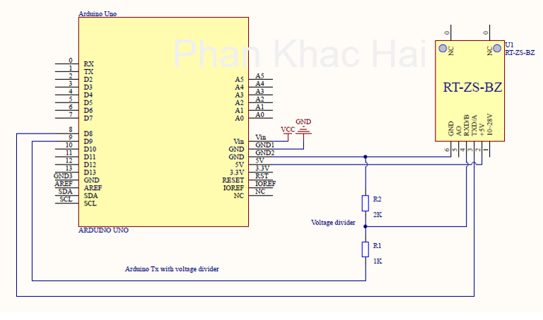

# Arduino Noise Sensor with KE-ZS-BZ-TTL-05


This Arduino project enables you to measure noise levels using the KE-ZS-BZ-TTL-05 Noise Sensor. It communicates with the sensor through AltSoftSerial and calculates the noise level in decibels (dB).

## Table of Contents

- [Hardware Requirements](#hardware-requirements)
- [Wiring](#wiring)
- [Usage](#usage)
- [Hex Command Format](#hex-command-format)
- [Data Receive Format](#data-receive-format)
- [Response Time](#response-time)

## Hardware Requirements

To use this project, you will need the following hardware components:

- Arduino board
- KE-ZS-BZ-TTL-05 Noise Sensor
- Jumper wires

## Wiring

Connect the KE-ZS-BZ-TTL-05 Noise Sensor to your Arduino as follows:

- Sensor RX to Arduino pin 9
- Sensor TX to Arduino pin 8
- Sensor +5V to Arduino 5V
- Sensor GND to Arduino GND



## Usage

1. Upload the Arduino sketch provided in this repository to your Arduino board.
2. Open the Arduino Serial Monitor.
3. The Serial Monitor will display the noise level in decibels (dB) in real-time.

## Hex Command Format

The project sends the following hex command to the sensor to request noise level data:

```hex
0x01 0x03 0x00 0x00 0x00 0x01 0x84 0x0A
```

This command initiates the sensor to provide noise level data.

## Data Receive Format

When requesting data from the sensor, it responds in the following format:

- Response: `0x01 0x03 0x02 0x02 0xC9 0x79 0x72`

In this response:

- `0x02 0xC9` represents the reading value of noise.
- In this example, `02C9` translates to 713, which corresponds to a noise level of 71.3 dB.

## Response Time

The sensor provides two response time options:

- Fast Mode: Set the delay to 500ms for faster responses.
- Slow Mode: Set the delay to 1.5 seconds for slower but more stable responses.

You can adjust the delay in your Arduino sketch to match your desired response time.
